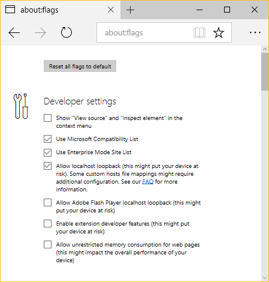

Edge Extenion Access to localhost
=================================

The localhost loopback is enabled by default nowadays.

When you have a local http server running and
enter a http://localhost URL to the adress bar,
the contents will display as expected.

However, XMLHTTPRequest for the same URL sent from an extension
backgroun script is blocked.  

Setup
-----

* Run localhost.bat. You need either node.js or python installed.
* Go to about:flags and enable extension developer features.
* Click the ... menu, then Extensions
* Load this extension, set "Show button next to the address bar"
* Click the extension button

Result
------

Two tabs show up, one displays http://localhost:23117/ directly,
the other diplays the result of the background script getting
the same URL.

Unless `CheckNetIsolation.exe LoopbackExempt -s` shows Edge,
the background script request is blocked with an exception
"TypeError: Failed to fetch".

Note
----

Edge container localhost can be un-isolated by

`CheckNetIsolation LoopbackExempt -a -n="Microsoft.MicrosoftEdge_8wekyb3d8bbwe"`

and isolated back by

`CheckNetIsolation.exe LoopbackExempt -d -n="Microsoft.MicrosoftEdge_8wekyb3d8bbwe"`

(using [NetworkIsolation](https://docs.microsoft.com/hu-hu/previous-versions/windows/desktop/api/netfw/nf-netfw-networkisolationsetappcontainerconfig)
functions from firewallapi.dll).
 
